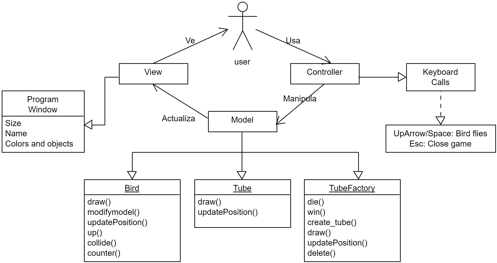

# Reporte de Documentación

*29 de Abril, 2022* \
*CC3501 - Modelación y Computación Gráfica para Ingenieros.* \
*Vicente Guzmán Pinto*

## índice
  - [1. Solución Propuesta](#1-solución-propuesta)
    - [1.1. Arquitectura de la Solución](#11-arquitectura-de-la-solución)
    - [1.2. Diagrama de Soporte](#12-diagrama-de-soporte)
  - [2. Instrucciones de Ejecución](#2-instrucciones-de-ejecución)
    - [2.1. Argumentos](#21-argumentos)
    - [2.2. Teclas de Control](#22-teclas-de-control)
  - [3. Resultados](#3-resultados)

## 1. Solución Propuesta

### 1.1. Arquitectura de la Solución
Se implementaron las librerías numpy 1.22.3, PyOpenGL 3.1.6 y GLFW 3.3.7

### 1.2. Diagrama de Soporte

## 2. Instrucciones de Ejecución

### 2.1. Argumentos

El programa recibe un argumento que representa el puntaje que debe obtener el jugador para ganar el juego.

- **N** = Puntaje para ganar.

   Se ejecuta mediante: ``python flappy bird.py N`` 

### 2.2. Teclas de Control

El juego solo recibe una tecla para jugar, pues es un clicker.

- **↑ (Up Arrow)** : Permite volar al Flappy Bird, elevándolo por un pequeño momento.
- **⎵ (Space Bar)** : Hace lo mismo que *Up Arrow*, incluido solamente para más comodidad.
- **Esc** : Cierra la aplicación.

## 3. Resultados

Se adjuntan imágenes para mostrar el resultado del juego: